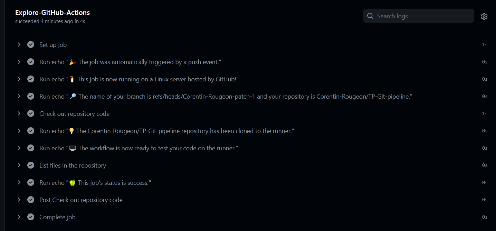
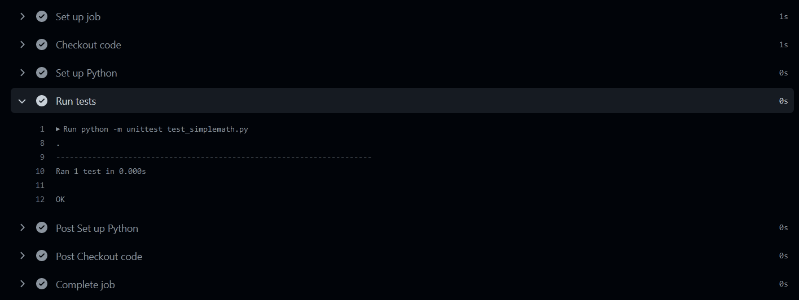
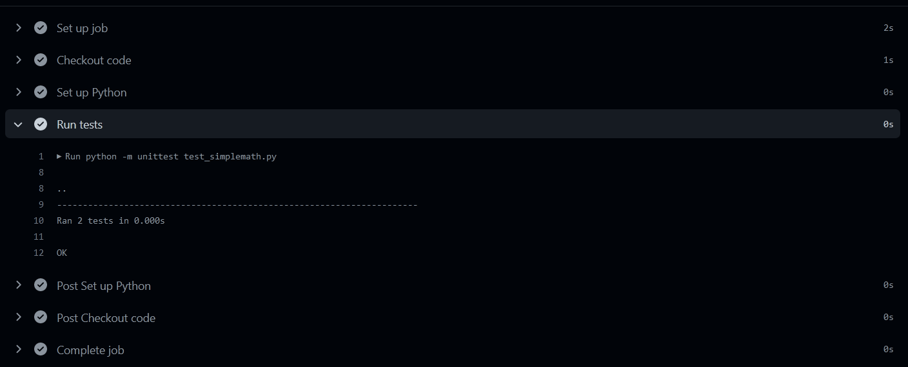
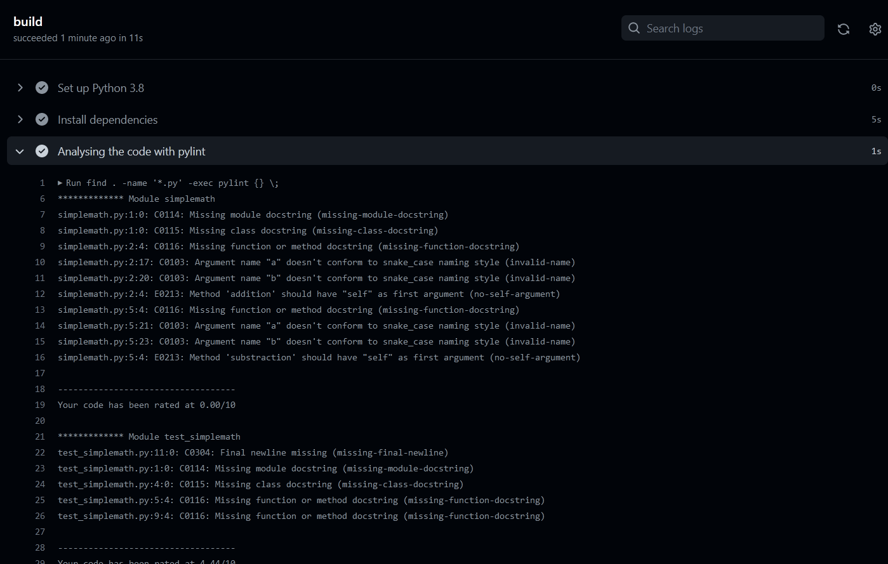
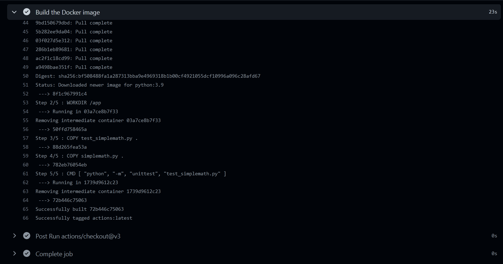

# TP - pipeline GITHUB
## ROUGEON Corentin

### 1. Lié votre compte via clé SSH à votre ordinateur


via gitbash on crée notre clé ssh :
`ssh-keygen -t ed25519 -C "corentin.rougeon@ynov.com"`

on Copie le contenue notre clé publique et on la colle dans 
`Setting > SSH and GPG KEYS > New SSH Key` via le site github 

pour tester notre clé :
`ssh -T git@github.com`

resultat :

`Hi Corentin-Rougeon! You've successfully authenticated, but GitHub does not provide shell access.`


### 2. Tester un premier workflow Github

creation d'un fichier workflow directement sur github 
dans `.github/workflows/github-actions-demo.yml`

```yaml
name: GitHub Actions Demo
on: [push]
jobs:
  Explore-GitHub-Actions:
    runs-on: ubuntu-latest
    steps:
      - run: echo "🎉 The job was automatically triggered by a ${{ github.event_name }} event."
      - run: echo "🐧 This job is now running on a ${{ runner.os }} server hosted by GitHub!"
      - run: echo "🔎 The name of your branch is ${{ github.ref }} and your repository is ${{ github.repository }}."
      - name: Check out repository code
        uses: actions/checkout@v3
      - run: echo "💡 The ${{ github.repository }} repository has been cloned to the runner."
      - run: echo "🖥️ The workflow is now ready to test your code on the runner."
      - name: List files in the repository
        run: |
          ls ${{ github.workspace }}
      - run: echo "🍏 This job's status is ${{ job.status }}."
```

test du workflow :



### 3. Créer deux classes python, une classe SimpleMath

`simplemath.py`
```python
class SimpleMath:
    def addition(a, b):
        return a + b
```

`test_simplemath.py`
````python
import unittest
from simplemath import SimpleMath

class TestSimpleMath(unittest.TestCase):
    def test_addition(self):
        result = SimpleMath.addition(1, 2)
        self.assertEqual(result, 3)
````

### 4. Créer un workflow permettant de lancer les tests unitaires de votre application.

`.github/test_add.yml`
```yaml
name: Test and Deploy

on: [push]

jobs:
  test:
    runs-on: ubuntu-latest

    steps:
      - name: Checkout code
        uses: actions/checkout@v2

      - name: Set up Python
        uses: actions/setup-python@v2
        with:
          python-version: 3.x

      - name: Run tests
        run: |
          python -m unittest test_simplemath.py
        env:
          CI: true
```

resultat du push:



### 5. Créer la fonction soustraction et le test associé

`simplemath.py`
````python
class SimpleMath:
    def addition(a, b):
        return a + b

    def substraction(a,b):
        return a - b

````

`test_simplemath.py`
````python
import unittest
from simplemath import SimpleMath

class TestSimpleMath(unittest.TestCase):
    def test_addition(self):
        result = SimpleMath.addition(1, 2)
        self.assertEqual(result, 3)

    def test_substraction(self):
        result = SimpleMath.substraction(1, 2)
        self.assertEqual(result,-1)
````

resultat push :


### 5. Ajouter une étape de lint 

`.github/workflows/pylin.yml`
```yml
name: Pylint

on: [push]

jobs:
  build:

    runs-on: ubuntu-latest

    steps:
      - uses: actions/checkout@v2
      - name: Set up Python 3.8
        uses: actions/setup-python@v1
        with:
          python-version: 3.8
      - name: Install dependencies
        run: |
          python -m pip install --upgrade pip
          pip install pylint
      - name: Analysing the code with pylint
        run: |
          find . -name '*.py' -exec pylint {} \;

```

resultat push :



### 7. Ajouter une étape qui build un conteneur Docker embarquant votre application


`dockerfile`

```dockerfile
FROM python:3.9

WORKDIR /app

COPY test_simplemath.py .
COPY simplemath.py .

CMD [ "python", "-m", "unittest", "test_simplemath.py" ]
```


`.github/workflows/docker-build.yml`

```yml
name: docker-build

on: [push]

jobs:

build:

    runs-on: ubuntu-latest

    steps:
      - uses: actions/checkout@v3
      - name: Build the Docker image
        run: docker build -f dockerfile -t actions .
```

resultat push :
